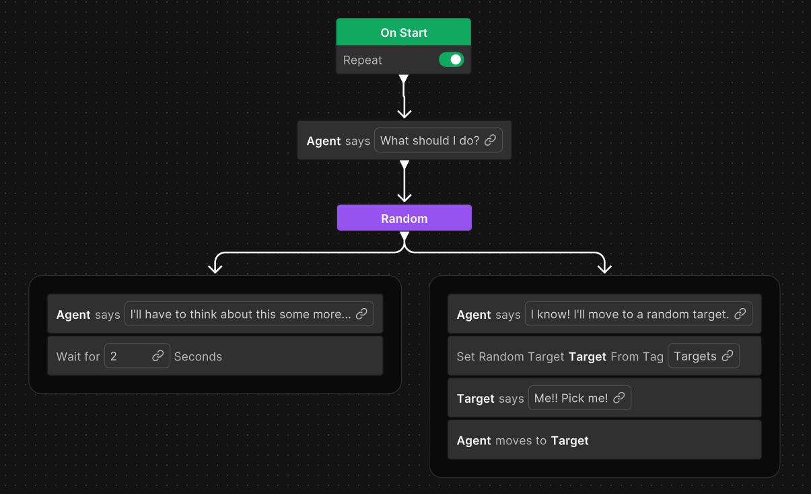

# Unity Behavior 

Unity Behavior is a visual tool designed for creating behaviors that control objects or characters. Like behavior tree and state machine editors, it lets users build behavior and decision units using an easy-to-read graphical interface.

Unity Behavior presents behavior as node-based flow graphs, read top-to-bottom, providing a clear script of execution. Each node in the script encapsulates the logic for a behavior step and is presented as a human-readable story. Tagged words in the story become pluggable parameters of the behavior, allowing users to edit or reassign their values through Unity Behavior's graphical interface.

The goal is to provide developers with iterative workflows. Unity Behavior includes a graphical editor, an agent component for GameObjects, and runtime graph debugging. Built-in wizards create new node and variable types, generating necessary C# boilerplate. Developers can quickly extend the tool with new functionality and customized game logic. 

Unity Behavior allows you to control the interactions of multiple characters, orchestrate cinematic scenes, trigger timed or contextual events, and react to player actions. It takes the complexity out of behavior authoring, enabling developers to bring their vision to life with ease.

