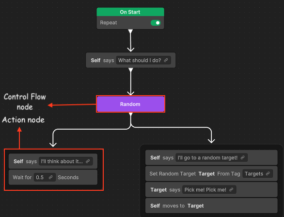
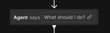
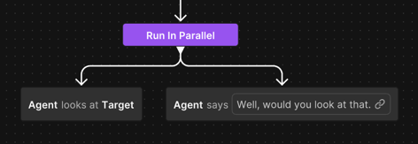
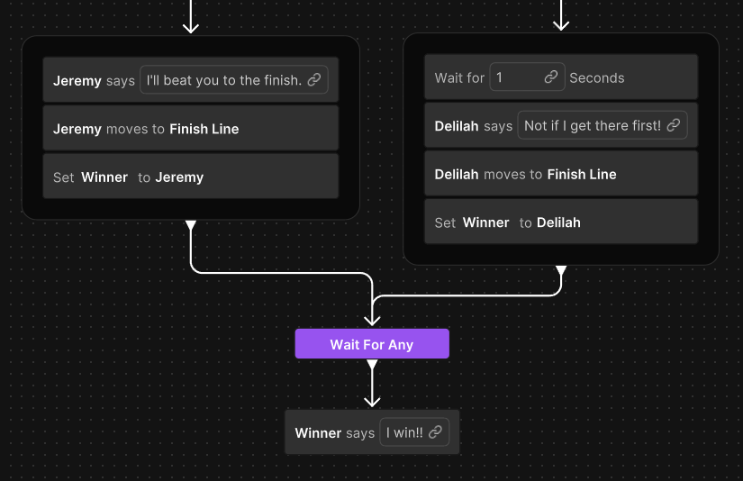

# Behavior graphs

A behavior graph is a hierarchical structure. It helps you create artificial intelligence (AI) in video games by enabling agents to dynamically transition between modular sets of tasks. This structure enables the composition of collections of simple tasks into complex, adaptive behaviors, facilitating the creation of sophisticated AI systems.

Unity Behavior provides a graph-based tool for designing behavior graphs through a graphical user interface. The visual representation of the agent's logic facilitates the understanding of the AI agent's behavior. This enables easier debugging and quicker authoring iterations. 

Each node in the graph contains logic for a single step of the entire behavior. The structure of the graph determines the following items:

* The run order of the nodes.
* What happens when nodes succeed or fail.
* Which nodes will run next based on the previous condition.

Nodes can be of two types:

* **Control flow node**: These nodes define how the logic flows through the graph and determine which nodes to run next. The different types of control flow nodes are [modifier nodes](behavior-graph.md#modifier-node), [sequencing nodes](behavior-graph.md#sequencing-node), and [join nodes](behavior-graph.md#join-node).

* **Action nodes** (shown in grey color): These nodes define the actual actions to run that encompass a wide range of tasks. For example:

    * Display a GameObject in the scene.
    * Move the AI agent towards a position.
    * Check for the distance to another target.
    * Store some value for further computation.
  
  For more information, refer to [Action node](behavior-graph.md#action-node).

Note that in the previous diagram, the highlighted box groups two action nodes, but each one is a separate action node.

For AI to execute an action, the logic flow starts at the top with the start node. It then flows down through the control flow nodes to the action nodes. 

Unity Behavior defines node types as `C#` classes in the project. Unity Behavior also includes some wizards and utilities to make it easier to create or edit node types.

In a behavior graph, nodes depict brief, human-readable stories where you can input context-specific data, such as variables, to drive the logic. These variables are relevant and applicable only within a particular scenario represented by a node in the behavior graph. For example, location of the agent in the game world or state of any nearby enemies.

## Nodes

Nodes are part of the behavior graph that define the flow of the graph. They control the sequence of events determining different paths down the graph, ensuring the agent behaves the way you specify. You can create and connect nodes using the Unity Behavior visual editor. Each node has a particular functionality attached to it. 

The behavior graph nodes are of four types: action node, modifier node, sequencing node, and join node.

### Action node

Action nodes typically don't have any children and serve as primary means of interaction with the scene and other objects within the behavior graph. They're the most important of node types available. 

An action can succeed or fail. An action can run immediately (in one frame) or require time to finish (for example, walking to a destination).

Actions are the most common form of node in a behavior graph, with other types of nodes handling the flow of execution between actions. Typically, actions are responsible for moving objects, triggering animations, modifying variable values, or otherwise interacting with the scene.

For example, you can use the **Talk** node to display the text spoken by the character.

  

  Another example of an action node is **Walk**. A **Walk** node makes a character walk to a specific point on the map.

### Modifier node

Modifier nodes control the execution flow of the behavior graph. They can have only a single child node. 

The modifier nodes perform the following functions:

* **Execution control**: They regulate how to run the child branch, such as repeating it or altering its run pattern.

* **Status modification**: They modify the status returned by the child node, influencing the behavior of parent control flow nodes.

You can find the modifiers in the **Flow** category of the node menu. For example,  **Repeat**, **Repeat Until Failure**, **Repeat Until Success**, **Repeat While Condition**, **Succeeder**, **Inverter**, **OnStart**, **Abort**, and **Restart**.

For example, you can use a **Repeat** node to loop indefinite behavior or use the **Inverter** node to invert the result of the child. 
  
  * If a child fails, it returns `success` to its parent.
  * If a child succeeds, it returns `failure` to the parent.

#### Abort and Restart nodes

**Abort** and **Restart** are types of Conditional nodes that work with conditions. Conditions evaluate and control the flow of actions, and determine which path the game's logic might take. 

The **Abort** node stops the current branch when one or all the conditions are true and returns failure to the parent node. For example, use the **Abort** node if an enemy needs to stop its current action and change to a defensive posture upon detecting a threat. Conversely, the **Restart** node resets and runs a branch from the beginning when one or all the conditions are true. For example, if an agent has a patrolling behavior where it's patrolling between way points, use a **Restart** node to check if the agent needs to restart the patrolling route from scratch.

1. Right-click an empty area of the Unity Behavior graph editor and click **Add**. Alternatively, press the **Spacebar** to open the same menu.  

    The **Add Node** window appears.
2. Select **Flow** > **Abort**.

3. To add an **Abort** node, select **Abort** or select **Restart** to add a **Restart** node.

   The selected node appears on the graph editor. To configure these nodes, use the **Node Inspector** window.

4. Select the node to display its settings on the **Node Inspector**.
5. Select **Abort** or **Restart** from the **Type** dropdown.
6. Depending on the type of node selected in the previous step, select **Any Are True** or **All Are True** from the **Aborts if** or **Restart if** dropdown.
7. Enable **Truncate Node** to combine multiple conditions or actions into a single, neat node. This makes the behavior tree less cluttered and easier to read.
8. To add conditions, select **Assign Condition**. For information on how to assign conditions, refer to [Use conditions with a Conditional node](conditional-node.md).

### Sequencing node

Sequencing nodes define the root of a branch and base rules for how to run the branch. They can have one or more children. 

The most common sequencing node, **Sequence**, processes its child nodes sequentially, running them from left to right in a step-by-step manner. Each child node runs one at a time, continuing as long as each step succeeds.

Another example of a sequencing node is **Random**, which randomly selects one child node to execute from its list of children.

You can find all sequencing nodes in the **Flow** category of the node menu. Other sequencing nodes used in the behavior graph include **Try In Order** and **Run In Parallel**.

  For example, you can use the **Run In Parallel** node to run all the branches in parallel.

  

  Another example of a sequencing node is **Sequence**, which runs each child in sequence. It returns failure when any of the children fails and returns success when every child returns a successful status. 

### Join node

Join nodes merge the branches so they're run together. Join nodes can have multiple parent branches but only one child branch. 

There are two types of join nodes:

  * **Wait For All**: Runs its branch after all incoming branches have finished.
  * **Wait For Any**: Runs its branch after at least one incoming branch has finished.

   

## Node statuses

All nodes in the behavior graph exist in one of five possible states, each with a corresponding status label and icon. 

The following table shows the node statuses along with their description.

| Node status | Description |
| ----------- | ----------- |
| **Running**  | The node is currently running. |
| **Waiting**   | The node is waiting on one or more of its child branches. |
| **Succeeded** | The node has succeeded. |
| **Failed**    | The node has failed. |
| **Uninitialized** | The node hasn't yet begun to run. |

## Additional resources

* [Behavior graph node types](node-types.md)
* [Unity Behavior user interface](user-interface.md)

