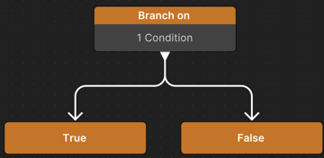

# Use conditions with a Conditional node

Conditional nodes check a set of conditions and, based on the results, determine how the graph runs its tasks. The flow of the behavior graph might change dynamically based on whether these conditions are met or not. For example, a Conditional node checks if the distance between two characters is below a threshold and triggers a dialog or an attack sequence.

## Use a Conditional node as a Flow node

To use a Conditional node as a Flow node, do the following:

1. Right-click an empty area of the Unity Behavior graph editor and select **Add** > **Flow** > **Conditional**.

2. Select the relevant Conditional node: **Conditional Branch** or **Switch**.

    

   The selected node displays on the Unity Behavior graph editor. By default, no conditions are assigned to the node.

3. To assign conditions to the **Conditional Branch** node, refer to [Conditional Branch](#conditional-branch).

### Conditional Branch

The **Conditional Branch** node redirects the flow of logic to the appropriate branch when the assigned condition is either true or false. This node can use multiple conditions.

To assign conditions to the **Conditional Branch** node, do the following:

1. In the **Node Inspector**, select the condition that must be true for the redirect to work from the **Check if** dropdown.

   The available options are **Any Are True** and **All Are True**.

2. (Optional) Enable **Truncate Node** to combine multiple conditions or actions into a single, neat node. 

   This makes the behavior tree less cluttered and easier to read.

3. Select **Assign Condition**.

   The **Add Condition** window displays.

4. Select **Create new Condition** to create a new custom condition or perform step 5 to use a pre-defined condition.

    1. In the **New Custom Condition** window, enter a **Name**, select the condition **Category**, and select **Next**.

    2. Describe the condition against which you want to evaluate the game's logic.

    3. For each GameObject, select the relevant **Variable Type**.

    4. Select **Create**. Unity Behavior generates a new `C#` script that defines the new condition.

    5. Select **Save**. To use the new condition, select **Assign Condition** > **Variable Conditions** > **[new_condition]**. 

5. Select **Variable Conditions** to add a pre-defined condition.

   The available options are:  
   * **Variable Comparison**: To use this condition, insert any variable from the **Blackboard** and use it to evaluate the condition.
   * **Variable Value Changed**: To use this condition, insert any variable from the **Blackboard**. It returns `True` if the value of the variable changes and `False` if the variable remains unchanged. You can use this condition with the **Abort** and **Restart** nodes. For more information, refer to [Abort and Restart nodes](behavior-graph.md#modifier-node).

6. Select the relevant pre-defined condition.  The selected condition appears both on the node and the **Node Inspector**. To remove a condition, right-click the condition in the **Node Inspector** and select **Delete**. 

If the **Conditional Branch** node evaluates one condition, it will branch off to either **True** or **False**. 

The following table shows the how the **Conditional Branch** node's logic branches off based on the **Check if** option selected and the number of conditions applied.

| Check if | Node evaluates one condition | Node evaluates multiple conditions |
| -------- | ------------- | ----------- |
| Any Are True | True - False | If Any Is True - If All Are False |
| All Are True | True - False | If All Are True - If Any Is False |

### Switch

The **Switch** node doesn't work with conditions, but it allows for branching logic to be used based on the value of an `Enumeration` variable.

For example, you can define an `Enumeration` variable called `GameState` that could use the values `Playing`, `Paused`, and `GameOver`.

## Use Conditional node as an Action node

To apply Conditional node as an Action node, do the following:

1. Right-click an empty area of the Unity Behavior graph editor and click **Add** > **Action** > **Conditional**.

2. Select **Conditional Guard**.
 
   The selected node displays both on the Unity Behavior graph editor and the **Node Inspector**.
    
   The **Conditional Guard** node allows the flow of logic to pass only if the assigned conditions are met. This node can use multiple conditions. 

3. In the **Node Inspector**, select the condition that must be true for the node to run from the **Continue if** dropdown.  The available options are **Any Are True** and **All Are True**.

   

4. To proceed, refer to the instructions in the [Conditional Branch](#conditional-branch) section, starting from steps 3.

If you have multiple conditions on the **Conditional Guard** node, Unity Behavior combines those multiple conditions into a single node and condenses the label on the node.

## Additional resources

* [Behavior graphs](behavior-graph.md)
* [Behavior graph node types](node-types.md)