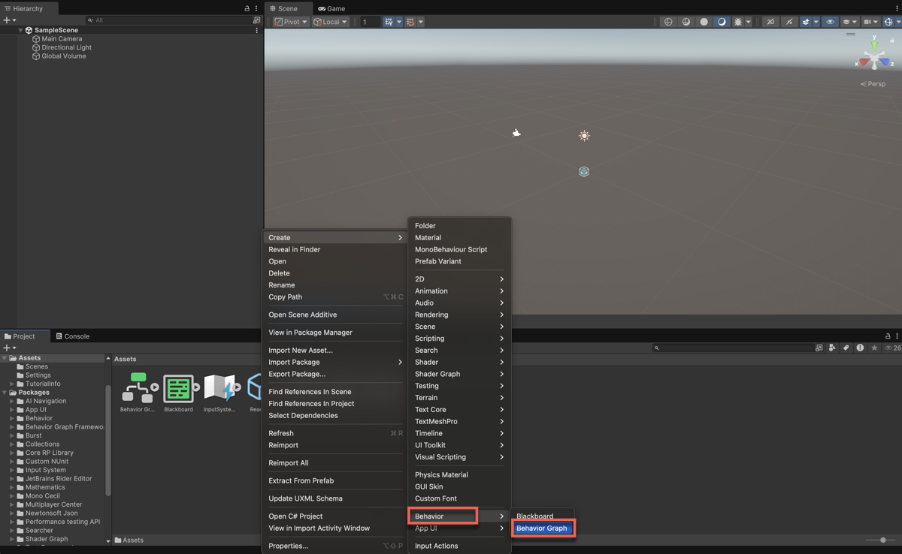

# Create a behavior graph

To create a new behavior graph, perform the following steps:

1. Right-click an empty area of the **Project** window.
2. Select **Create** > **Behavior** > **Behavior Graph**.

   

   Unity Behavior can create the new asset (behavior graph) in either of the following two places: 
   
   * The directory you select in the **Project** window.
   * At the top level of the **Assets** - **Project** window if you use the menu.

3. Enter a name for the new behavior graph.
4. Double-click the new behavior graph to open it in the Unity Behavior editor. 

You're now ready to implement the logic of your behavior graph.

To enable the graph to run the appropriate behavior for a given situation, create one of the following nodes:

* [Action node](node-types.md#action-node-types)
* [Event node](node-types.md#events-node-types)
* [Flow node](node-types.md#flow-node-types)

Unity provides a set of pre-defined nodes. These include:

* General purpose actions
* Event-driven behavior
* Control flow 

You can also create your own custom nodes to tailor the behavior of your artificial intelligence (AI) experience to your specific needs. 

To continue creating a behavior graph, you can do the following:

* [Use pre-defined nodes](predefined-node.md)
* [Create your own custom nodes](create-custom-node.md) based on your requirements

## Additional resources

* [Use a pre-defined node](predefined-node.md)
* [Create a custom node](create-custom-node.md)
* [Behavior graph example](example.md)

