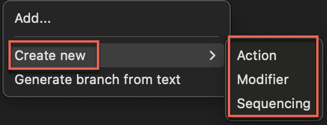
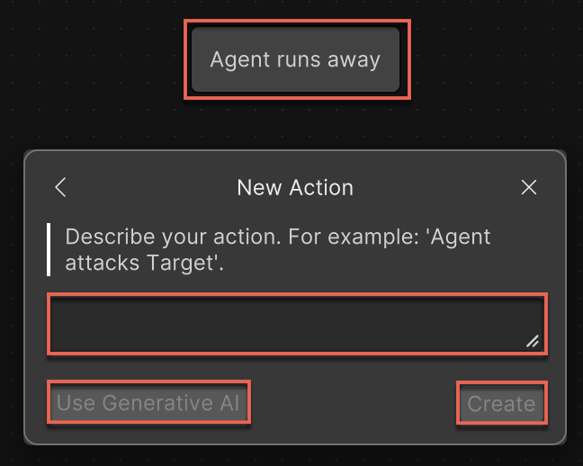
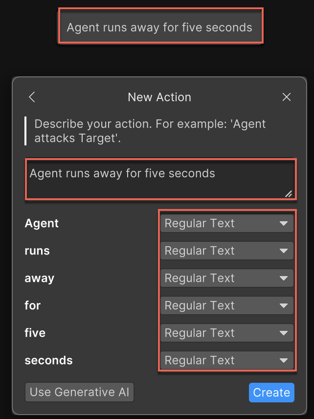
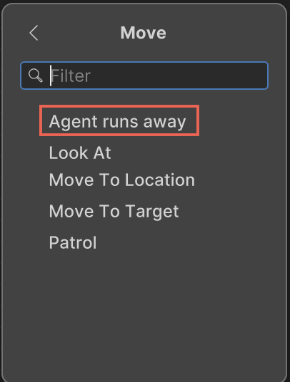
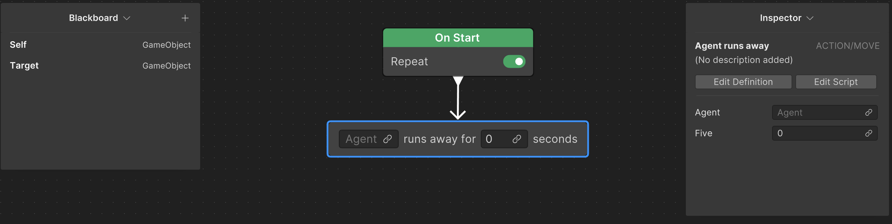

# Create a custom node

If you can't find the required node in the pre-defined node list of Unity Behavior, you have the option to create custom nodes. You can create custom **Action**, **Modifier**, and **Sequencing** nodes. 

This section outlines the process for creating a custom **Action** node. You can apply these instructions identically to create custom **Modifier** and **Sequencing** nodes. 

To create a custom node, perform the following steps:

1. Right-click an empty area of the Unity Behavior graph editor and select **Create new**.

    You can create three different types of nodes: **Action**, **Modifier**, and **Sequencing**.

    

2. To create a custom **Action** node, select **Action**.

   The **New Action** window appears.

3. Enter a name for the action that describes the agent's behavior in the **Name** field. For example, `Agent runs away`.
4. Select a category from the **Category** list if you want to sort the new node in a particular subgroup in the menu or leave it with the default **Action** value so that it's available at the root of the **Action** node list.

    For example, you can place the new action node, `Agent runs away`in the **Action/Move** category.

5. Select **Next**.

    Unity Behavior adds the new custom node to the behavior graph.

    

6. Enter a description for your action in natural language.

    This information will determine how the node appears on the graph and what link fields the node will have. For example, `Agent runs away from the enemy and hides behind a tree for 2 seconds`.

    Unity Behavior lists all the elements specified in the action on the window along with a list of data types.
    
    

7. Select the appropriate variable from the list for each element.

    > [!NOTE]
    > When describing the action, if you use a word that's the same as one of the **Blackboard** variables, it's automatically assigned the correct data type. For example, if the word `Target` with the `GameObject` data type is already defined on the **Blackboard** and you use it when describing the action, Unity Behavior will automatically assign the `GameObject` data type to the word `Target`.  

8. Select **Create** to manually create the new custom node type or select **Use Generative AI** to create the base of the node's logic. For information on using the Generative AI feature, refer to [Create a behavior graph with Unity Behavior's generative AI](about-genai.md).

    Unity Behavior generates a new `C#` script that defines the logic of the node. It has the story (as defined previously) as an attribute and the link fields as **Blackboard** variables. Additionally, it contains some empty overrides for the three possible entry points for a node's logic: `OnStart`, `OnUpdate`, and `OnEnd`.

   The new action type appears in the context menu when you select `Add` > `Action` > `[sub_category]` > `[new_node]`.

     

9. Select the new node to use it in the behavior graph.

    

## Additional resources

* [Create a behavior graph](create-behavior-graph.md)
* [Use a pre-defined node](predefined-node.md)
