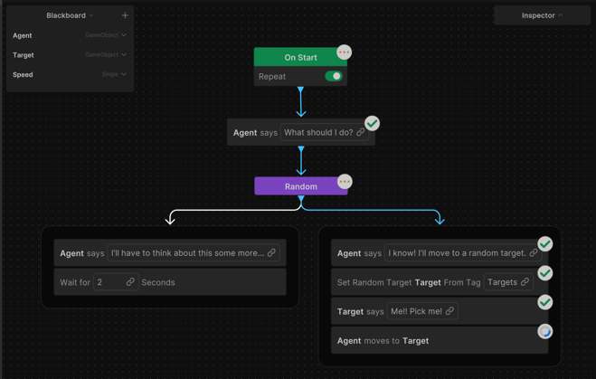

# Debug the agent in real time during Play mode

To monitor how your behavior graph runs, debug the agent in real time during Play mode.

Perform the following steps:

1. Select **Debug** on the behavior graph editor's toolbar. 

    The **Debug** menu lists all the agents in the current behavior graph that have the `Agent` component assigned. 

2. Select the relevant agent to enable debugging.

    

     After you select an agent, the toggle activates to display that debugging is active.

3. You can now play the scene to view the statuses of the nodes.

    

    While the scene runs, the statuses of the nodes will display with icons directly on the nodes in the behavior graph editor.

## Additional resources

* [Create a behavior graph](create-behavior-graph.md)
* [Unity Behavior editor user interface](user-interface.md)
