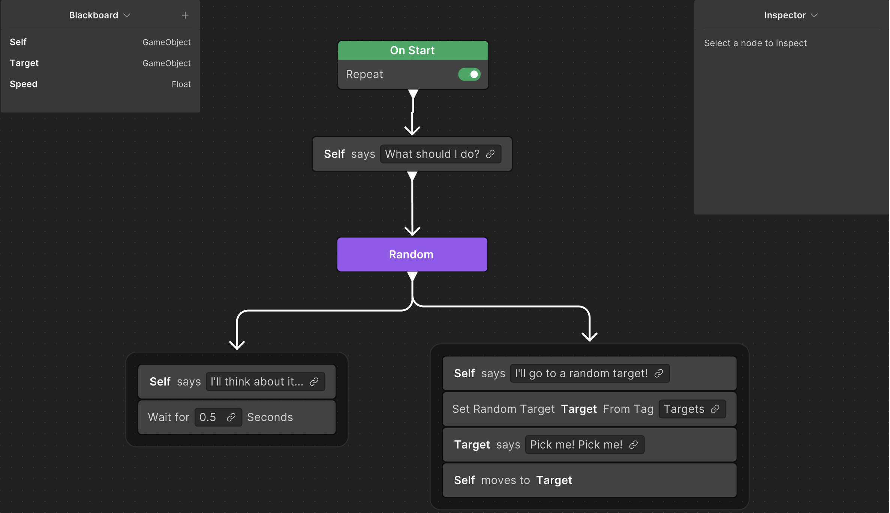
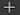
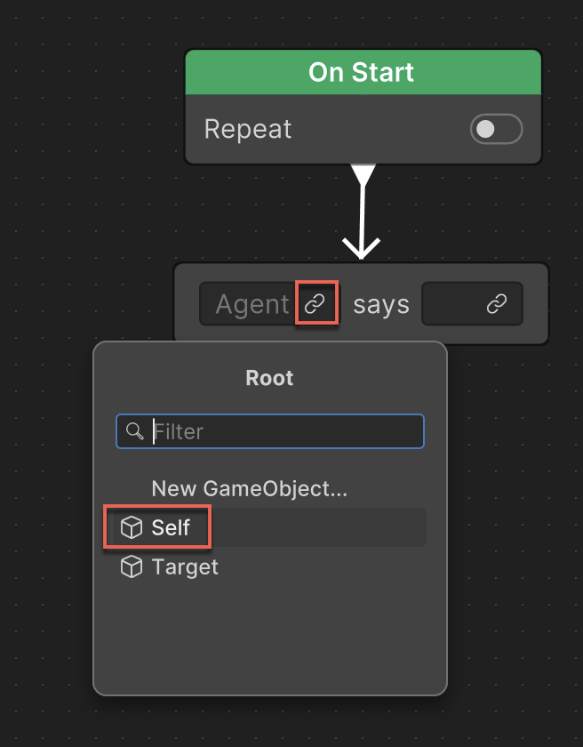
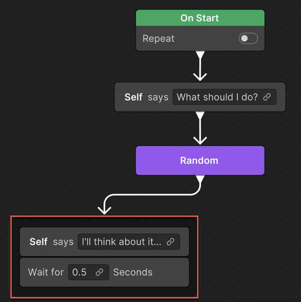
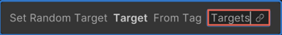
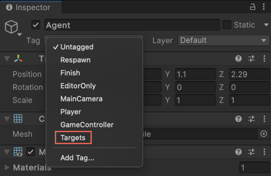
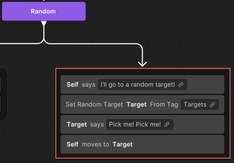
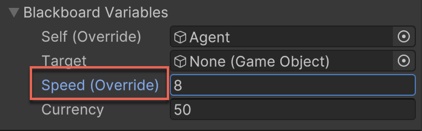
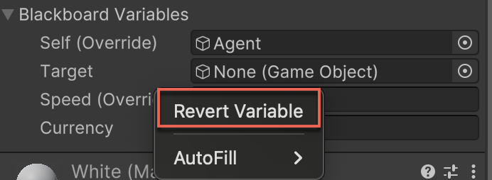

# Behavior graph example

This section provides an example to illustrate how to create a behavior graph. The scenario involves an agent (GameObject) that randomly makes a choice between two actions, showcasing different functionalities of behavior graph. The agent has the following two options:

* Think about what to do and wait for 5 s.
* Talk to itself and search for a random target (GameObject) that talks or calls out a message for the agent. Consequently, the agent selects that target and moves towards it. 

This example illustrates the implementation of decision-making processes and action sequences within behavior graphs.

By the end of this example, you will create a behavior graph that looks like:

To create this behavior graph, perform the following steps:

1. Right-click any empty area of the **Project** window.
2. Select **Create** > **Behavior** > **Behavior Graph**.
3. Enter a name for the new behavior graph.
4. Double-click the new behavior graph to open it in the Unity Behavior editor. You're now ready to implement the logic of your artificial intelligence (AI).

    The start node is already provided on the Unity Behavior graph editor.
5. To create a control flow node, right-click any empty area of the Unity Behavior graph editor and select **Add**.

    The **Add Node** window appears.
6. To add a **Talk** node, select **Action** > **Talk**.

    Unity Behavior adds the **Talk** node to the graph.

   > [!NOTE]
   > When you add your first node, the Unity Behavior tutorial displays a message to help you with the next step. To proceed with the tutorial, select **Continue**.

7. Join the **On Start** node to the new **Talk** node.

   1. Drag the **Talk** node so it's aligned below the **On Start** node.
   2. Hover your cursor over the bottom of the **On Start** node until a connector arrow appears.
   3. Drag the connector arrow from the **On Start** node to the **Talk** node.

8. Create the variables required in the behavior graph. In this example, you need three variables: `Self`, `Target`, and `Speed`. By default, the `Self` variable is already available on the **Blackboard**.

    To create the remaining variables, perform the following steps on the **Blackboard**.

    1. Click the plus () icon.
    2. Select **Object**.
    3. Type a name for the new variable, for example `Target`.
    4. Click the plus icon again and select **Float**.
    5. Name the new float variable as `Speed` and specify a value. For example, `2`.
9.  Select the link icon in the **Agent** field of the action node to link it with a variable on the **Blackboard** and select **Self**.

    

10. Enter the relevant text in the field besides **Self says**.

    This is the dialog or the sentence that your character will speak. For example, `What should I do?`.

11. Add a **Random** flow node. To do this, right-click any empty area of the Unity Behavior graph editor and select **Add**.

    The **Add Node** window appears.
12. Select **Flow** > **Random**.

    Unity Behavior adds the **Random** node to the graph.

13. Join the previously created **Talk** node to the new **Random** node.

Now create two branches that the agent can execute at random. In the first branch, the agent will talk to itself and then wait for 0.5 seconds. In the second branch, the agent will talk to itself, select a random target, and then move towards the target.

## First branch

1. Create a **Talk** node, as described in the previous procedure.

   (Right-click > **Add** > **Action** > **Talk**). 
2. Select the link icon in the **Agent** field of the action node to link it with a variable on the **Blackboard** and select `Self`.
3. Type `I'll think about it!` in the field beside **Self says**.
4. To add a **Wait** node, right-click any empty space of the Unity Behavior graph editor and select **Add**.
5. Select **Action** > **Wait**.

    Unity Behavior adds the **Wait** node to the graph.
6. Enter `0.5` as the seconds value.
7. Group both of these actions so they run sequentially. To do this, drag the **Talk** node to the top half of the **Wait** node until a blue line appears. Then, drop the node to create a group.
8. Join this group to the **Random** node created in step 12 of the first procedure.

    

## Second branch

1. Create a **Talk** node using the same steps from the first procedure. 

   (Right-click > **Add** > **Action** > **Talk**). 
2. Select the link icon in the **Agent** field of the action node to link it with a variable on the **Blackboard** and select `Self`. 
3. Type `I'll go to a random target!` in the field beside **Self says**.
4. To assign a target to a random object, right-click any empty space of the Unity Behavior graph editor and select **Add**.
5. Select **Action** > **Set Random Target**.

    Unity Behavior adds the **Set Random Target** node to the graph.
6. Type `Targets` in the field beside **Tag**. The Unity Behavior sample includes a scene where its GameObjects are already tagged with the `Targets` value.

    

    This corresponds to the **Tag** field values shown in the Unity Editor's **Inspector** window.

     

   > [!NOTE]
   > If you're creating your own scene (rather than using the `SampleScene` included with the Unity Behavior sample), be sure to tag some of your GameObjects with the `Targets` value. To do this, use the **Tag** drop-down menu in the Unity Editor's **Inspector** window (not Unity Behavior editor's **Inspector** window). For more information on creating and assigning tags, refer to [Tags](https://docs.unity3d.com/Manual/Tags.html).

7. Create another **Talk** node (Right-click > **Add** > **Action** > **Talk**) and link the **Agent** field to the `Target` variable. 
8. Type `Pick me! Pick me!!` in the field beside **Target says** field.
9. Add a **Move to Target** node to move the agent to the target. To do this, right-click an empty area of the Unity Behavior graph and select **Add** > **Action** > **Move** > **Move To Target**. 

     Unity Behavior adds the **Move To Target** node to the graph.
10. Link the **Agent** field to the `Self` variable. To do this, select the link icon in the **Agent** field and select `Self`.
11. Group these four actions so they run sequentially. To do this, drag the **Talk** node to the top half of the **Set Random Target** node until a blue line appears. Then, drop the node to create a group. Similarly, add the other **Talk** node and **Move to Target** node at the bottom of the **Set Random Target** node to create a group of four nodes.
12. Select the four nodes in your group by using your cursor to drag a bounding box around the nodes. A blue line surrounds the group.
13. Move the group so it's near the bottom right of the **Random** node.
14. Join this group to the **Random** node created in step 12 of the first procedure.

    

You have successfully created the sample behavior graph. 

## Test your behavior graph in a scene

Now that your behavior graph is complete, you can observe it in Play mode.

1. If you haven't installed the Unity Behavior sample, install it by referring to [Install Unity Behavior with the Package Manager](install-behavior.md#samples).

2. From the **Project** window, drag `SampleScene` from `Assets/Samples/Behavior/[Version_Number]/Unity Behavior Example` to the **Hierarchy** window.

3. If you have multiple scenes, select `SampleScene` and set it as the active scene.

4. Enter Play mode and observe the behavior of the GameObjects.

Because your behavior graph has multiple branches that run randomly, you can play your scene multiple times to check the different behaviors.

## Update variables in real time

In Unity Behavior, the `C#` code updates most variables, such as `Agent` and `Target`. However, if you're testing a feature or iterating on a variable, you need to change their values in real time. For example, when debugging in Play mode, you might need to increase an agent's speed in real time. 

To update the variables available on the **Blackboard** in real time, perform the following steps:

1. Click the **Hierarchy** window of the Unity Editor. 
2. Select **SampleScene** > **Agent**.
3. In the **Inspector** window of the Unity Editor, scroll down to the **Behavior Graph Agent (Script)** section.

    The **Inspector** window displays all the variables used in the current scene.

   The example graph described in this section displays the following **Blackboard** variables:

   * `Self`
   * `Target`
   * `Speed` 

4. Select a different GameObject or input a new value.

    If you change the value of a variable, Unity will append **Override** next to the variable name as shown in the following image.

   

5. To change the value of the variable to the original one, right-click the variable and select **Revert Variable**. 

   

## Additional resources

* [Create a behavior graph](create-behavior-graph.md)
* [Use a pre-defined node](predefined-node.md)
* [Create a custom node](create-custom-node.md)