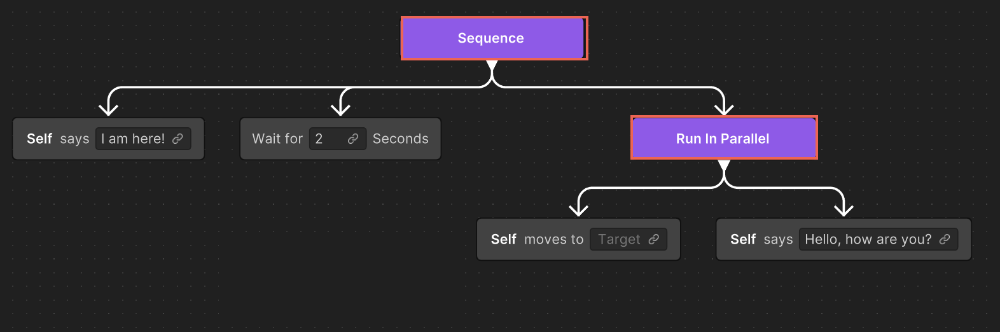

# Create a branch with generative AI

Creating a branch using generative artificial intelligence (AI) is essential for developing intelligent AI behaviors in Unity Behavior. By defining alternative paths or decision points within the AI's behavior logic, branches allow for the creation of dynamic and responsive behaviors. 

This process enables the AI to handle various scenarios and conditions, making decisions and taking different actions based on specific inputs or situations. You can use generative AI to simplify the creation of these branches, ensuring that even simple behaviors can evolve into complex responses within your project.

To create a behavior graph or a branch of an exiting behavior graph using generative AI, perform the following steps:

1. Right-click an empty area of the Unity Behavior graph editor and select **Generate branch from text**.
2. Enter a descriptive prompt for the desired behavior and select **Use Generative AI**. For example, `Say "I am here" then wait for two seconds. After that, do these two actions at the same time: move to the Target, say "Hello, how are you?"`.
    
    Unity Behavior generates a new sequence of nodes.
    
    
    If you specify an action that doesn't exist in the project, Unity Behavior creates a placeholder node in the behavior graph. For more information on how to work with placeholder nodes, refer to [Placeholder node in a behavior graph](placeholder-nodes.md).

After generating a branch, you can modify the behavior graph as needed. You can rearrange the nodes to fit your requirements, including adding, deleting, or editing the nodes and branches. Generative AI typically provides a good foundation for the behavior, making it easier for you to refine and customize.

## Additional resources

* [Create an action node using generative AI](gen-ai-node.md)
* [Placeholder node in a behavior graph](placeholder-nodes.md)
* [Best practices for using generative AI](gen-ai-best-practices.md)
