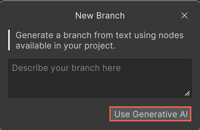

# Best practices for using generative AI

You can use Unity Behavior's generative artificial intelligence (AI) feature to automatically create a behavior graph using natural language instead of manually creating it.

Here are some best practices to help you get started with generative AI in Unity Behavior:

* **Get Muse subscription**: The **Use Generative AI** feature is disabled by default. To access the generative AI features of Unity Behavior, you need a Muse subscription.

    

* **Be specific and detailed**: Clearly describe the action or behavior you want to create. The more detailed your description, the more accurate the generated code is. For example, use `make the character move to the target location at a certain speed.` instead of `make the character move`.

* **Use clear and concise language**: Avoid ambiguous terms and ensure your prompt is clear and understandable. For example, replace vague phrases like `do something interesting` with specific actions like `make the character jump and spin 360 degrees.`.

* **Include necessary context**: Provide any relevant context that might affect the behavior. For example, if the behavior depends on certain conditions, include them. `If the health is below 2, make the character seek health packs.`.

* **Describe the desired outcome**: Clearly state the expected result of the action. For example, `make the Target patrol between two points continuously until the Agent is detected.`.

* **Break down complex actions**: If the desired behavior involves multiple steps, break it down into simpler components. For example, `first, make the character crouch, then crawl forward, and finally stand up when they reach the destination.`.

By following these guidelines, you can provide accurate and detailed descriptive prompts to get optimal code from generative AI.

## Additional resources

* [Create a branch using generative AI](gen-ai-behavior-graph.md)
* [Create an action node using generative AI](gen-ai-node.md)
