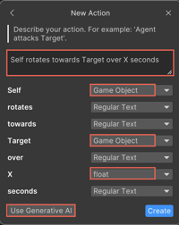
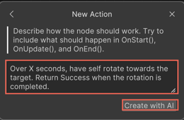
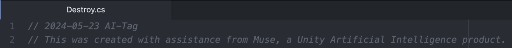
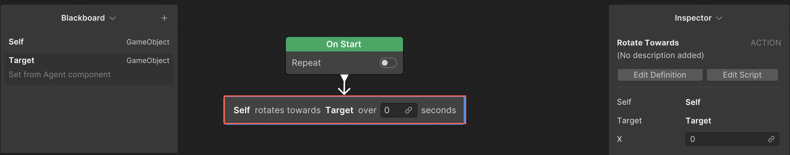

# Create an action node with generative AI

To create an action using the generative artificial intelligence (AI) feature of Unity Behavior, perform the following steps:

1. Right-click an empty area of the Unity Behavior graph editor and select **Create new** > **Action**.

    The **New Action** window appears.
2. Enter a name for the new action. For example, `Rotate Towards`.
3. Select a category from the **Category** list to sort the new node into a specific subgroup in the menu. Alternatively, you can leave it with the default **Action** value to make it available at the root of the **Action** node list.
4. Select **Next**.
5. Type a description (including variable, if any) of what the node might do. For example, `Self rotates towards Target over X seconds`.

    Note that Unity Behavior lists all the elements specified in the description on the window as variables along with a list of data types. If you have already created and defined the variable on the **Blackboard**, Unity Behavior identifies it and uses the relevant data type.

    
6. Select the appropriate data type from the list for each variable.
7. Select **Use Generative AI**.
8. Specify more information about how the node might work. For example, `Over X seconds, have self rotate towards the target. Return `Success` when the rotation is completed.`.

    
9. Select **Create with AI**.

    Unity Behavior generates the `C#` code for the action and directs you to save it.
10. Once saved, Unity Behavior opens the code in an Integrated Development Environment (IDE), for example, Visual Studio.

    The code displays a statutory legal message at the top indicating that Unity Behavior generative AI tool has generated the code.

    
    
    The new node appears on the Unity Behavior graph editor.

    
11. Place the node at the relevant position in the behavior graph by performing the following steps:
    1. Click the node you want to move. 
    2. Drag the node to the relevant position in the behavior graph.
    3. Release the mouse button to drop the node into place.
12. To link the variable to the link field, click the **link** icon in the new node and select the relevant variable from the list.

You're now ready to use the new node in the behavior graph.

> [!NOTE]
> You can try to [generate a branch](gen-ai-behavior-graph.md) first to check the behavior generated by the AI, including any [placeholder nodes](placeholder-nodes.md). Then, create nodes from these placeholder nodes. This method pre-fills the placeholder nodes with information such as name, story, and variables, making it easier to customize them instead of starting from scratch.

## Additional resources

* [Create a branch using generative AI](gen-ai-behavior-graph.md)
* [Placeholder node in a behavior graph](placeholder-nodes.md)
* [Best practices for using generative AI](gen-ai-best-practices.md)