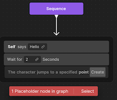
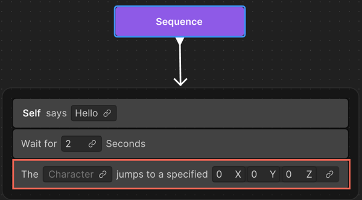

# Placeholder node in a behavior graph

If you create a behavior graph with nodes that aren't already available in the project, Unity Behavior generates the missing nodes for you. 

Additionally, if you delete an existing action in your project, a placeholder node automatically appears in your graph in place of the deleted action.

To replace the placeholder nodes with nodes created with generative artificial intelligence (AI):

1. Right-click an empty area of the Unity Behavior graph editor and select **Generate branch from text**.
2. Specify a descriptive prompt for the desired behavior, such as, `Self says "Hello", then waits for 2 seconds, and then jumps to a point.`.
3. Select **Use Generative AI**.

   Unity Behavior recognizes that the action `jumping to a specific point` isn't defined in the project, so it creates a placeholder node in the behavior graph.

    
4. To create the missing logic, select **Create**.

    The **New Action** window appears.
    
    By default, generative AI provides a name for the new action based on the available information. For example, `Jump To Point`.
5. Select **Next**.
6. Specify a description for the new action. By default, generative AI provides a description for the new action based on the available information. For example, `The character jumps to a specified point`.
7. Select the appropriate data type from the list for each variable. 
8. Select **Use Generative AI**.
9. Specify detailed information on how the node might work. For example, `OnStart(), the character jumps to the desired point and return success.`.
10. Select **Create with AI**.
11. Select **Save** to save the generated `C#` code at the appropriate location.

    Note that the new generated node replaces the placeholder node in step 2.
    
    

## Additional resources

* [Create a branch using generative AI](gen-ai-behavior-graph.md)
* [Placeholder node in a behavior graph](placeholder-nodes.md)
* [Best practices for using generative AI](gen-ai-best-practices.md)
