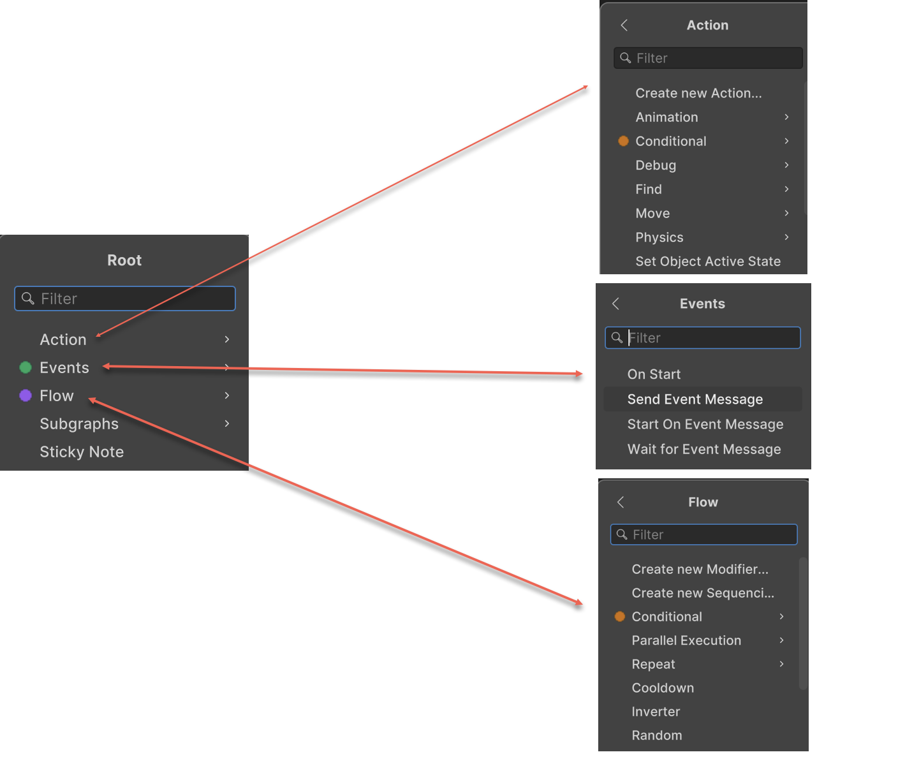
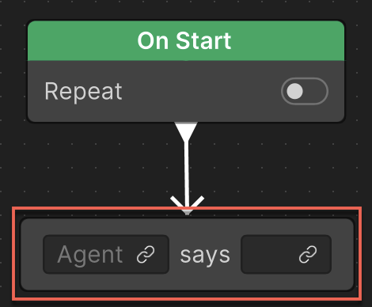
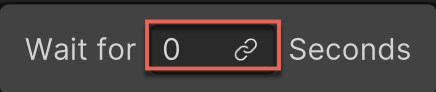
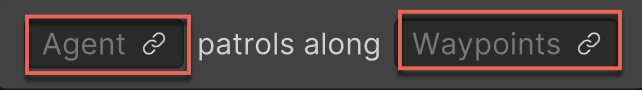
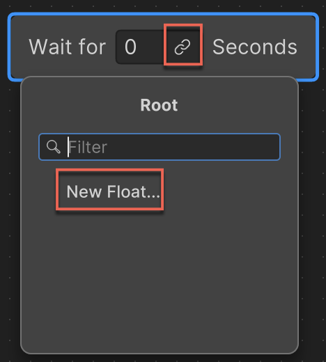
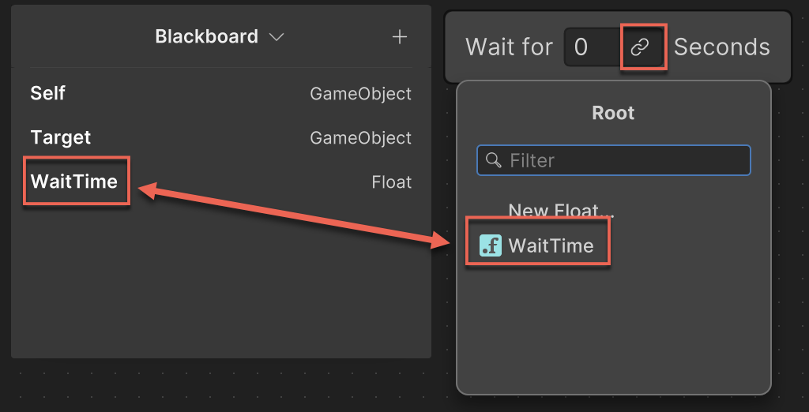
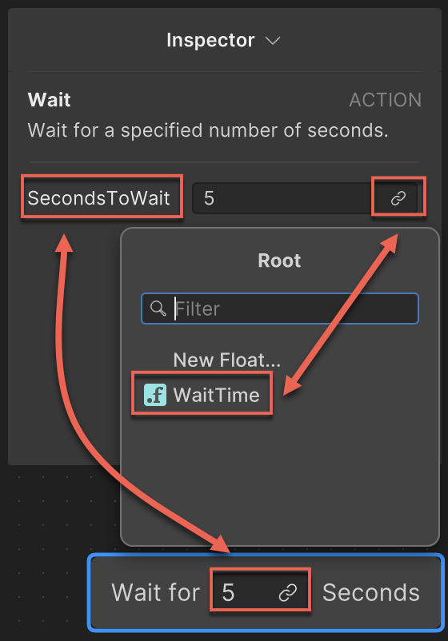
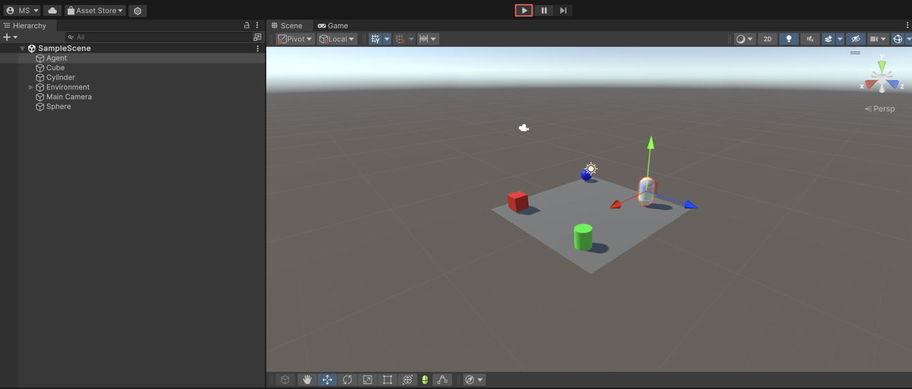
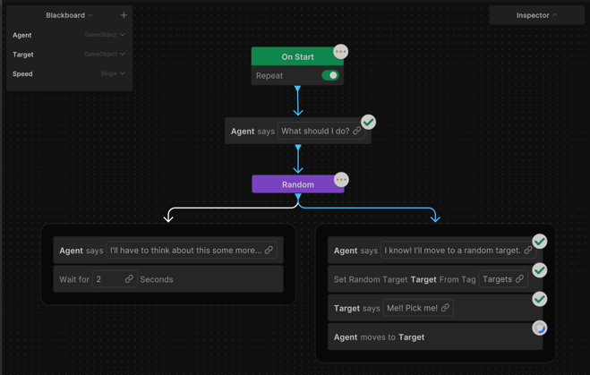

# Use a pre-defined node

Use this section to apply the pre-defined action, event, and flow nodes to the behavior graph.

> [!NOTE]  
> You can't modify the pre-defined nodes, but you can inspect their script using the **Inspect Script** option in Behavior graph's **Inspector**. Review these nodes to learn and gain valuable insights on how to create your own custom nodes.

1. Right-click an empty area of the Unity Behavior graph editor and click **Add**.

    The **Add Node** window appears.  
2. Perform one of the following steps:
    1. To add an Action node, click **Action**.
    2. To add an Event node, click **Events**.
    3. To add a Flow node, click **Flow**.

3. Click the relevant node type and select the node you want to use in your behavior graph. 

    

For example:

* If you want your character or agent to wait for a specified number of seconds before running the next step, use the **Wait** node by clicking **Action** > **Wait**.
* If you want your character or agent to transition between different possible states (for example, idle, attack, and flee), use the **Switch** node by clicking **Flow** > **Conditional** > **Switch**.

    Unity Behavior adds the selected node to the graph.  

4. Join the **On Start** node to the new node using the connectors. 

    To link two nodes in the editor, begin by selecting the first node. Then, position the cursor near the base of the node to reveal the output connector, typically depicted by an arrow. Drag a line from this output connector to the input connector of the second node.

    

    Nodes include fields featuring a link icon that enables connection to a variable on the **Blackboard**. These fields, called link fields (shown in the previous image), vary in number from node to node. For example, the **Wait** node has one link field while the **Patrol** node has two link fields.

    **Wait** node:

    

    **Patrol** node:

    

5. Create variables required in the behavior graph on the **Blackboard**.

    1. Click the plus () icon.
    2. Select the relevant variable. For example, if you want to create a `Target` variable, select **Object** as it's a GameObject. 
    3. Click the new variable to rename the GameObject. For example, `Target`. 
    
        Alternatively, to create a new variable, click the link icon in the link field, click on the **New [data type]** option, and then rename it. The new variable appears on the **Blackboard**. You can now use your new variable in the behavior graph.
        
        

    4. Repeat the previous two substeps to add more variables for your behavior graph.

6. Link the variable to the relevant link field.

    For example, if you create a `Speed` variable with **Float** data type, link it to the **SecondsToWait** link field to specify how long artificial intelligence (AI) must wait before running the next step.

    To link the variable to the link field, click the **link** icon and select the relevant variable from the list.

   

7. To edit additional parameters for a node, select the node to view the parameters on the node **Inspector** floating window in the Unity Behavior editor (not the Unity Editor **Inspector** window). 

     Use these nodes to further customize the behavior graph's logic. 

    

8. To inspect your behavior graph in real-time or to debug a GameObject, click **Debug** and select the relevant GameObject.

9. Open the Unity Editor's Game view and click the **Play** button to run your game in Play mode.

    

    The behavior graph shows the flow of logic in real time while the game is running. This helps in understanding which actions are running and why.

    

10. Repeat the previous steps to add more nodes to your behavior graph.

For a step-by-step guide on how to create a simple behavior graph, refer to the [behavior graph example](example.md).

## Additional resources

* [Create a behavior graph](create-behavior-graph.md)
* [Create a custom node](create-custom-node.md)