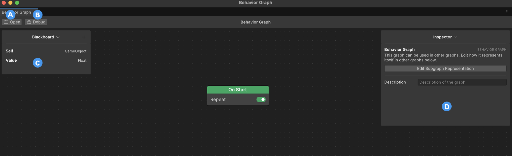

# Unity Behavior editor user interface

This section provides a tour of the most common components of the Unity Behavior editor.

| Component | Description |
| --------- | ----------- |
| **A**: **Open** | Provides access to the existing behavior graphs. It's found on the behavior graph editor's toolbar. |
| **B**: **Debug** | Helps in debugging any issues in the behavior graph. It allows you to select a GameObject for debugging and observe its behavior in real time during Play mode. The **Debug** option is available on the behavior graph editor's toolbar. For more information, refer to [Debug the Agent in real time during Play mode](debug.md). |
| **C**: **Blackboard** | Is the memory of the behavior graph. Use it to define all the variables you need to make decisions and inform your logic of the current context. You can write the required input fields that are filled at runtime. |
| **D**: **Inspector** | Provides detailed information about a node. It enables you to inspect the nodes and other elements on the behavior graph. It also allows you to view variables and set values for the selected node. |

## Additional resources

* [Install Unity Behavior with the Package Manager](install-behavior.md)
* [Get started with Unity Behavior](get-started.md)
* [Debug the Agent in real time during Play mode](debug.md)

