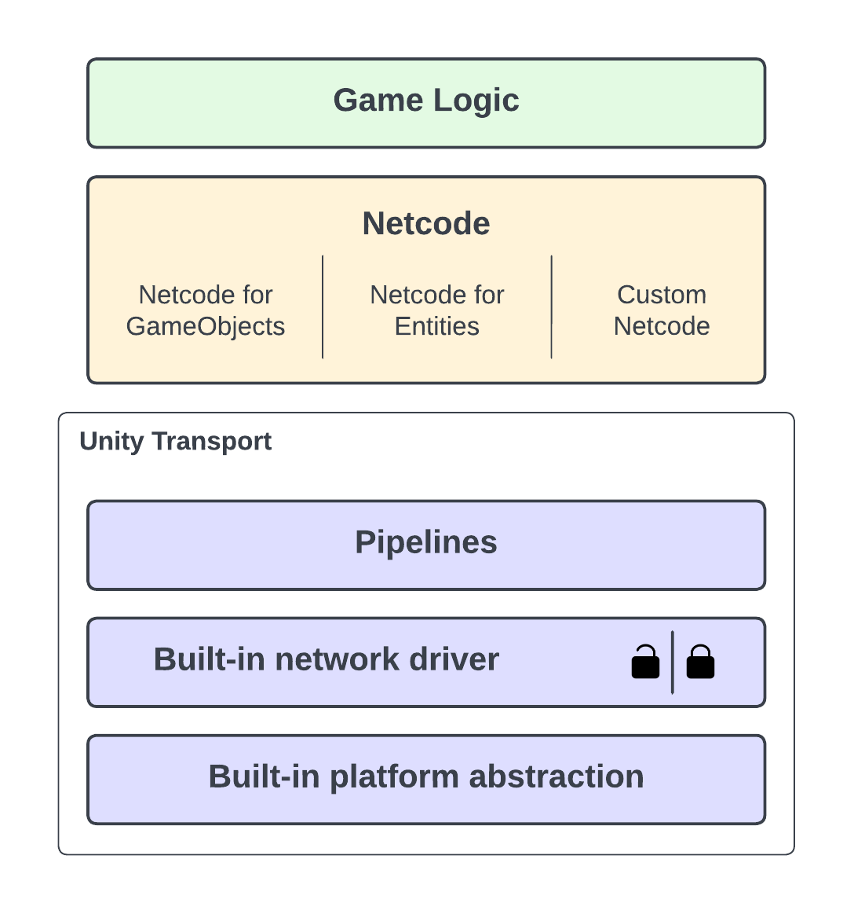

# About Unity Transport

The Unity Transport package (`com.unity.transport`) is a low-level networking library geared towards multiplayer games development.

It is used as the backbone of both Unity Netcode solutions: [Netcode for GameObjects](https://docs-multiplayer.unity3d.com/netcode/current/about) and [Netcode for Entities](https://docs.unity3d.com/Packages/com.unity.netcode@latest)
but it can also be used with a custom solution.

All the platforms supported by the Unity Engine are seamlessly supported by Unity Transport
thanks to a connection-based abstraction layer (*built-in network driver*) it provides over either UDP sockets or WebSockets. Both can be setup with or without encryption, embodied by the closed and open padlocks in the above block diagram.

Cherry on top, *pipelines* offer additional optional functionalities like reliability, packet ordering, and packet fragmentation.

## Using Unity Transport

* If you are a first user of the package, the first sections of this manual will walk you through [the installation](install.md) of the package and [the creation of your first client and server](client-server-simple.md).
* If you are upgrading from a previous version of the package, you may want to refer to our [1.X migration guide](migration.md).

## Requirements

Unity Transport supports all platforms supported by the Unity Engine. For WebGL, only WebSocket connections in client mode are supported (it is however still possible to host games if using [Unity Relay](https://unity.com/products/relay)).

### Editor compatibility matrix

The page you are reading is the documentation for Unity Transport 2.X, which is only compatible with Unity Editor 2022.3 and later. Older editor versions are supported by Transport 1.X. Here is the compatibility matrix:

| Editor Version | 2021 LTS | 2022 LTS | 2023.1 and later |
|:--------------:|:--------:|:--------:|:----------------:|
| Transport 1.X  | **Yes**  | **Yes**  | No               |
| Transport 2.X  | No       | **Yes**  | **Yes**          |

### Which version should I use?

If you are using Unity Transport on its own, we recommend using version 2.X if your editor version supports it. If you are using Unity Transport as part of one of Unity's Netcode solutions, refer to the table below for the _minimum_ supported version for each solution:

| Editor Version                    | 2021 LTS      | 2022 LTS       | 2023.1 and later |
|:---------------------------------:|:-------------:|:--------------:|:----------------:|
| Netcode for GameObjects (1.2.0+)  | Transport 1.X | Transport 1.X  | Transport 2.X    |
| Netcode for Entities (1.0.0+)     | N/A           | Transport 2.X  | Transport 2.X    |
| Recommended for custom solutions  | Transport 1.X | Transport 2.X  | Transport 2.X    |

## Note
This package should not be confused with the `NetworkTransport` abstraction in Netcode for GameObjects. Please see the [transports section of its documentation](https://docs-multiplayer.unity3d.com/netcode/current/advanced-topics/transports) for more information.
